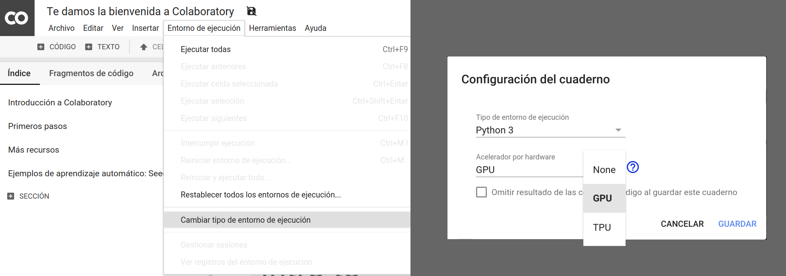
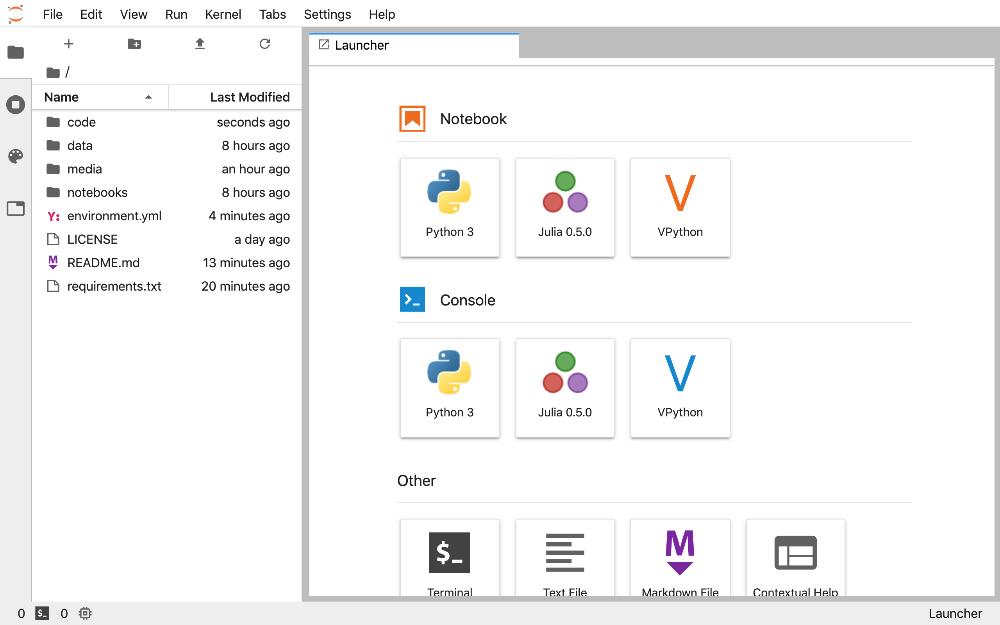

## $5 Tech Unlocked 2021!
[Buy and download this product for only $5 on PacktPub.com](https://www.packtpub.com/)
-----
*The $5 campaign         runs from __December 15th 2020__ to __January 13th 2021.__*

# Generative Adversarial Networks (GANs) with TensorFlow 2.0

> Generative Adversarial Networks (GANs) with TensorFlow 2.0, Published by Packt. <br>
> _**Course instructor:** [Rodolfo Ferro](https://github.com/RodolfoFerro)_

Generative Adversarial Networks (GANs) is an active research and development area with numerous new techniques and innovations in recent months. The presence of new tech developments using GANs is growing and getting stronger. This course will not only help you learn the working mechanism of GAN models but also teach you to apply them to different domains of knowledge, such as computer vision.

In this course, you will learn about the main changes in Tensorflow 2.0, by starting with a quick review of a Deep Learning implementation with this new changes. Then, you will learn how each component in a GAN model operates by implementing GANs using the functionalities and services offered by Tensorflow 2.0 and Google Colab ecosystem. You will then go further into the various GAN architectures using different datasets in order to build efficient and powerful GAN models on different domains. With every section, you will have an understanding of how these simple-to-intermediate GANs, and how GANs operations can be implemented using real-world examples.

By the end of this course, you will be able to build and contribute to real-world projects and the open-source community using GANs.


## Content

This material has been exclusively developed for its usage along the course **Generative Adversarial Networks (GANs) with TensorFlow 2.0**, by Packt.

The content covered along the course is the following:
- Section 1 - [Building your first Deep Learning model with Tensorflow 2.0](https://github.com/PacktPublishing/Generative-Adversarial-Networks-GANs-with-TensorFlow-2.0/tree/master/Section%201) 
- Section 2 - [GANs explained](https://github.com/PacktPublishing/Generative-Adversarial-Networks-GANs-with-TensorFlow-2.0/tree/master/Section%202)
- Section 3 - [Deep Convolutional GANs for image generation](https://github.com/PacktPublishing/Generative-Adversarial-Networks-GANs-with-TensorFlow-2.0/tree/master/Section%203)
- Section 4 - [Pix2Pix: Conditional GANs in action](https://github.com/PacktPublishing/Generative-Adversarial-Networks-GANs-with-TensorFlow-2.0/tree/master/Section%204)
- Section 5 - [CycleGANs: More on image translation](https://github.com/PacktPublishing/Generative-Adversarial-Networks-GANs-with-TensorFlow-2.0/tree/master/Section%205)

Each section contains a description of its material and contents.


## Setup instructions

All the code will be developed with Python 3.7+ using [TensorFlow 2.0](https://www.tensorflow.org/), which adopts [Keras](https://www.tensorflow.org/versions/r2.0/api_docs/python/tf/keras) as the high level interface to build, train and deploy AI models.

#### Requirements:

* A laptop.
* This GitHub repository already cloned and updated before the workshop.
* A Python 3.7+ environment with Anaconda (suggested).
  * See options 1 and 2.
* Passion to learn something new!

The course is taught using *notebooks*, free-to-use documents with executable code, Markdown text, equations, visualizations, images and more. These notebooks can be created and executed on the cloud via Google Colab (option 1) or locally using your own computer through [Jupyter Notebooks or Jupyter Lab](https://jupyter.org/) (option 2). Also, a local IDE will be used for the AI model serving.

### Option 1: Google Colab

[Colab](https://colab.research.google.com) is a Google service that allows us to execute cloud-based *notebooks*. It provides Python 2 and 3 environments, with CPUs, GPUs and TPUs (for free!). You only need to have a Google account or create one.

I highly recommend you to choose an environment with Python 3 and GPUs. To activate it:

* Open the "`Runtime`" menu
* Choose the option "`Reset all runtimes...`"
* Open again the "`Runtime`" menu
* Choose the option "`Change runtime type`"
* Select Python 3 as the "`Runtime type`" and GPU as the "`Hardware accelerator`"

The following screenshot illustrates the process.



In [Colab](https://colab.research.google.com), you can create a new notebook, upload an existent one or import it directly from Google Drive or GitHub.

### Option 2: Local environment

I highly recommend you to have installed Python 3.7+ (**added to your PATH**), manage virtual environments, and install dependencies using [**Anaconda**](https://www.anaconda.com/).

1. Star and clone the repository:

   ```bash
   $ git clone https://github.com/PacktPublishing/Generative-Adversarial-Networks-GANs-with-TensorFlow-2.0.git
   $ cd Generative-Adversarial-Networks-GANs-with-TensorFlow-2.0
   ```

2. To create a virtual environment with Python 3.7 using Anaconda, just run the following command:

   ```bash
   $ conda create --name packt-ganstf2 python=3.7
   ```

   And to activate/deactivate the vitual environment simply run:

   ```bash
   # To activate
   $ conda activate packt-ganstf2

   # To deactivate (when you're done)
   $ conda deactivate
   ```

3. To install dependencies listed in the `requirements.txt` file, just use `pip` to run installation as follows:

   ```bash
   (packt-ganstf2)$ pip install -r requirements.txt
   ```

4. Now you should be able to write code! To open Jupyter Lab just run:

   ```bash
   (packt-ganstf2)$ jupyter lab
   ```

That last command should open a new tab/window on your web browser, as in the following screenshot:



As in Google Colab, you can create a new notebook in the `New -> Python 3` option. To close the Jupyter Notebook you can press the `Quit` button and then close the tab or window of your web browser.

> **Extra:**
> If you want to have a nice-looking development environment with Jupyter Lab, I encourage you to install a nice theme. To do so, simply run in your terminal (with the virtual/conda environment activated):
> ```bash
> $ jupyter labextension install jupyterlab-tailwind-theme
> ```
> That's it. Now you should be able to activate the theme in your settings once you run your Jupyter Lab.


## About the author

Rodolfo Ferro is a science and tech enthusiast and an experienced developer of tech solutions using automation, machine learning, web services, computer vision, web data extraction, and data analysis. Also, he has experience helping startups and entrepreneurs with the power of AI.

Currently, he is the Community Leader at [Codeando México](https://codeandomexico.org/), but he has also served as a tech consultant for his local government, worked as a remote developer and served as a research assistant in applied AI at the Mathematics Research Center, part of the National Consortium of Science and Technology in Mexico. He has also participated in a research project during a summer internship with the Aspuru-Guzik Research Group, in the Department of Chemistry and Chemical Biology at Harvard University, working with applied machine learning for molecular properties.

For several years, he has been actively participating in building AI and tech communities. He co-founded [Future Lab](https://futurelab.mx/), he is a [member](https://githubcampus.expert/RodolfoFerro/) of the GitHub Campus Experts community, part of [Omdena](https://omdena.com/) as a community builder, and he has also served as a Google Student Ambassador and as a core member in a GDG, among others.

Feel free to reach him out to start collaborating!

– [@FerroRodolfo](https://twitter.com/FerroRodolfo/)